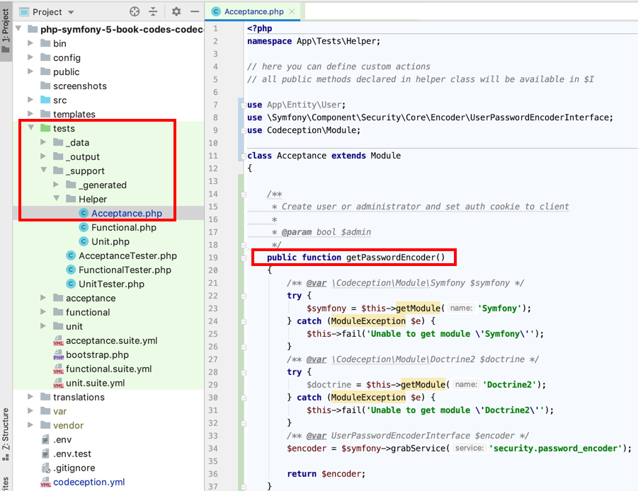

# php-symfony-5-book-codes-codeception-09-user-creation-with-have-in-repo

Link to main book codes

https://github.com/dr-matt-smith/php-symfony-5-book-codes

<hr>

helper class for encoder:



code for test now simple:

```php
    public function testEncodeIntoDatabase(AcceptanceTester $I)
    {
        $email = 'tester@test.com';
        $role = 'ROLE_ADMIN';
        $plainTextPassword = 'password';

        $user = new User();
        $user->setEmail($email);
        $user->setRole($role);

        // password - and encoding
        /**
         * @var  UserPasswordEncoderInterface $passwordEncoder
         */
        $passwordEncoder = $this->passwordEncoder;
        $encodedPassword = $passwordEncoder->encodePassword($user, $plainTextPassword);
        $user->setPassword($encodedPassword);


        // from_support/Helper/Acceptance.php
        $I->haveInRepository('App\Entity\User', [
            'email' => $user->getEmail(),
            'password' => $user->getPassword(),
            'role' => $user->getRole()
        ]);

        $I->seeInRepository('App:User', [
            'email' => $user->getEmail(),
            'password' => $user->getPassword(),
            'role' => $user->getRole()
        ]);

        var_dump("\n password = {$user->getPassword()}");
    }
```


source:
https://medium.com/@andrew72ru/symfony-4-codeception-371ba6408ae5

tests/_support/Helper/Functional.php

/**
* Create user or administrator and set auth cookie to client
*
*
@param
 bool $admin
*/
public function setAuth(bool $admin = false)
{
/**
@var
 \Codeception\Module\Symfony $symfony */
try {
$symfony = $this->getModule('Symfony');
} catch (ModuleException $e) {
$this->fail('Unable to get module \'Symfony\'');
}
/**
@var
 \Codeception\Module\Doctrine2 $doctrine */
try {
$doctrine = $this->getModule('Doctrine2');
} catch (ModuleException $e) {
$this->fail('Unable to get module \'Doctrine2\'');
}
/**
@var
 UserPasswordEncoderInterface $encoder */
$encoder = $symfony->grabService('security.password_encoder');
/**
@var
 Uuid $uuid */
$uuid = $doctrine->haveInRepository('App\Entity\User', [
'title' => 'Test User Title',
'email' => 'testemail@example.com',
'isActive' => true,
'roles' => $admin ? ['ROLE_ADMIN'] : ['ROLE_USER'],
'password' => $encoder
->encodePassword(new \App\Entity\User(), 'user_passWord'),
]);
$user = $doctrine->grabEntityFromRepository('App\Entity\User', [
'id' => $uuid->toString(),
]);
$token = new UsernamePasswordToken($user, null, 'main', $user->getRoles());
$symfony->grabService('security.token_storage')->setToken($token);
/**
@var
 \Symfony\Component\HttpFoundation\Session\Session $session */
$session = $symfony->grabService('session');
$session->set('_security_main', serialize($token));
$session->save();
$cookie = new Cookie($session->getName(), $session->getId());
$symfony->client->getCookieJar()->set($cookie);
}


And in test class:

public function tryToSeeMainPage(FunctionalTester $I)
{
    $I->setAuth(); // Make client authenticated
    $I->amOnRoute('main_page');
    $I->seeResponseCodeIs(200);
    $I->seeElement('nav');
    $I->see($I->grabService('translator')->trans('Personal Area'));
}